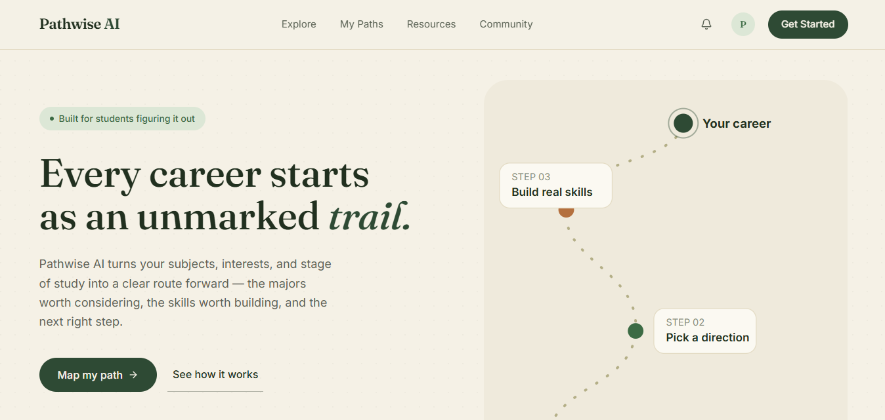

# PathWise-AI



PathWise-AI is an interactive career guidance platform built for Nigerian graduates and job seekers.
It helps users explore career paths, build relevant skills, and complete hands-on projects through curated learning roadmaps, assessments, and practical workspaces.

## 🚀 Features

- **Career Roadmaps:** Step-by-step skill paths for roles like Frontend Developer, Backend Developer, Fullstack Developer, Product Designer, and more.
- **Skill Assessments:** Interactive quizzes and progress checks to validate knowledge and prepare for the next level.
- **Project Workspaces:** Guided, real-world projects designed to reinforce learning and help users build portfolios.
- **Resource Library:** Curated learning links and resources for every stage of the career path.
- **AI Agent Integration:** Built with AIQ toolkit support for intelligent career guidance and recommendations.
- **Responsive UI:** Fast modern frontend experience using React, Tailwind CSS, and Vite.

## 📁 Repository Structure

- `PathWise-Backend/` — NestJS backend with authentication, Prisma ORM, mailer, JWT, and API endpoints.
- `PathWise-frontend/` — React frontend with Vite, Tailwind CSS, routing, and interactive UI components.

## 🧩 Technologies

- Backend: NestJS, Prisma, PostgreSQL/MySQL compatible ORM, JWT auth, Swagger, Nodemailer
- Frontend: React, Vite, Tailwind CSS, React Router, Framer Motion, FontAwesome
- Tooling: ESLint, Prettier, Jest, Prisma Migrations

## ⚙️ Setup Instructions

### Backend

1. Open a terminal in `PathWise-Backend/`
2. Install dependencies:
   ```bash
   npm install
   ```
3. Prepare Prisma and database:
   ```bash
   npx prisma generate
   npx prisma migrate deploy
   ```
4. Start the backend server:
   ```bash
   npm run start:dev
   ```

> Note: Configure environment variables before running the backend. The backend uses application config for secrets, database connection, JWT, and mail settings.

### Frontend

1. Open a terminal in `PathWise-frontend/`
2. Install dependencies:
   ```bash
   npm install
   ```
3. Start the frontend development server:
   ```bash
   npm run dev
   ```

## 🚀 Run the Full App

1. Start the backend first in `PathWise-Backend/`
2. Start the frontend in `PathWise-frontend/`
3. Open the frontend URL shown by Vite in your browser

## 🧪 Tests

- Backend tests: `npm run test` from `PathWise-Backend/`
- Backend e2e tests: `npm run test:e2e` from `PathWise-Backend/`

## 💡 Notes

- The frontend is designed as a responsive educational platform for career planning and skill development.
- The backend includes authentication, token refresh, email support, and Prisma-managed database models.

## 📄 License

This repository is currently configured as a private project.
